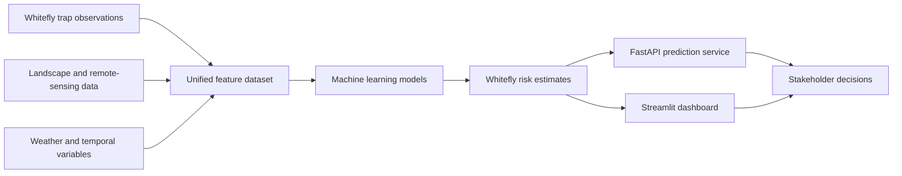

# Whitefly Risk Intelligence

### From trap observations to location-aware pest-risk intelligence


## Overview

**Whitefly Risk Intelligence** is an ongoing end-to-end geospatial and machine learning project focused on understanding and predicting sweetpotato whitefly (*Bemisia tabaci* B cryptic species) activity in southern Georgia.

The project brings together weekly trap observations, site information, land-cover data, vegetation indices, and other environmental variables to build a location-aware whitefly risk-prediction system.

The long-term goal is to transform raw monitoring data into actionable risk signals that can help agricultural stakeholders identify where and when whitefly pressure is likely to increase.

The project is being developed across the complete data science lifecycle- from data collection and feature engineering to modeling, deployment, and pipeline automation.

## Why This Project Matters

Sweetpotato whitefly is a major pest in the southern Georgia and across the southeastern United States, where outbreaks threaten economically important vegetable and row-crop production by reducing crop quality and yield while increasing monitoring and management costs.

Existing monitoring data can show where whiteflies have already been observed, but growers and advisers benefit most when that information can help answer forward-looking questions:

- Which locations are most likely to experience increased whitefly pressure?
- When is the risk expected to rise?
- Which environmental and landscape conditions are associated with higher counts?
- Where should field scouting and monitoring efforts be prioritized?
- How can historical monitoring data be converted into a repeatable decision-support system?

Whitefly Risk Intelligence aims to move from **describing past observations** toward **anticipating future pest risk**.

## Problem Statement

Weekly whitefly trap observations provide a valuable record of pest activity, but trap counts alone do not fully explain why activity changes across locations and time.

Important signals may also come from:

- surrounding crop and land-cover composition
- weather and temperature patterns
- seasonality and degree-day accumulation
- recent whitefly activity
- vegetation conditions
- soil and environmental characteristics
- spatial relationships between monitoring locations

The central challenge is to combine these different sources into a reliable feature set and use them to estimate future whitefly risk at a given location and time.

## Project Vision



## Major Project Themes

| Theme | What it involves | Status |
|---|---|---|
| **Problem formulation** | Framing the task around estimating future weekly whitefly pressure at monitored locations, using one trap and collection date as the core observation unit | 🟢 Established |
| **Data collection** | Extracting trap metadata and weekly whitefly observations and acquiring environmental data | 🟢 In development |
| **Feature-set building** | Combining trap observations with land cover, weather, temporal, vegetation, and spatial variables | 🟡 In progress |
| **Data processing** | Cleaning, validating, joining, and transforming data into modeling-ready tables | 🟡 In progress |
| **Feature engineering** | Creating lagged counts, rolling summaries, seasonal indicators, land-cover fractions, and environmental features | 🟡 In progress |
| **Modeling** | Developing baseline, statistical, and machine learning models for whitefly risk prediction | ⚪ Planned |
| **Evaluation** | Testing predictions on later growing seasons and locations, comparing them with simple baselines, and measuring forecast accuracy and risk calibration | ⚪ Planned |
| **Application development** | Creating an interactive map-based dashboard for exploring trap activity, predicted risk, historical trends, and the environmental factors influencing each prediction | ⚪ Planned |
| **Deployment** | Packaging and deploying the application using FastAPI, Docker, and Streamlit | ⚪ Planned |
| **Pipeline automation** | Scheduling data refreshes, feature generation, model updates, and monitoring with Apache Airflow | ⚪ Planned |

## Data Collection and Feature-Set Building

### Whitefly monitoring data

The current data pipeline extracts site-level information and weekly whitefly observations from the EDDMapS-backed StopWhitefly monitoring system.

The pipeline captures:

- site identifiers;
- trap labels;
- latitude and longitude;
- monitoring status;
- first and most recent report dates;
- observation year;
- collection date;
- weekly whitefly count.

The modeling unit is:

```text
one trap location × one collection date
```

The current development dataset contains more than **6,100 weekly observations across 31 monitoring sites**, covering the period from **2020 through 2026**.

### Landscape features

Annual National Land Cover Database rasters are used to describe the landscape surrounding each monitoring site.

Land-cover composition is calculated within:

- a 500-meter buffer;
- a 1-kilometer buffer.

The current feature-building workflow produces land-cover fractions for:

- cultivated crops;
- pasture and hay;
- developed land;
- forest;
- grassland and herbaceous cover;
- shrub and scrub;
- wetlands;
- water;
- barren land.

Together, these produce 18 location- and year-specific land-cover features.

### Planned feature groups

Additional feature families will include:

- recent whitefly-count lags
- rolling count averages and trends
- week, month, and seasonal indicators
- temperature and precipitation
- growing degree days
- humidity and related weather conditions
- vegetation and remote-sensing indices
- soil and crop-environment characteristics


## Data Processing and Feature Engineering

The processing layer is being designed to convert multiple raw data sources into a consistent modeling table.

Core tasks include:

- schema and data-type validation
- missing-value detection
- duplicate observation checks
- coordinate and geometry validation
- date normalization
- spatial coordinate transformation
- raster and vector integration
- year-to-year environmental data alignment
- land-cover aggregation
- temporal lag generation
- rolling-window feature creation
- leakage-aware feature preparation
- reproducible processed data outputs

Validation is built directly into the pipeline so that unexpected source-data changes are detected before they reach the modeling stage.

## Modeling Strategy

The modeling stage will compare progressively more capable approaches rather than beginning with a single complex algorithm.

Planned model families include:

- seasonal and historical baselines
- linear and regularized regression
- count-based statistical models
- random forests
- gradient-boosted trees
- XGBoost
- time-aware ensemble models

The initial modeling objective will be to estimate future weekly whitefly activity and translate model outputs into interpretable risk levels such as:

```text
Low Risk → Moderate Risk → High Risk
```

Model interpretation will also be used to investigate which landscape, weather, seasonal, and historical variables contribute most strongly to predicted risk.

## Evaluation Strategy

The evaluation framework will include:

- time-based training and validation splits
- rolling or expanding-window validation
- comparison against simple seasonal baselines
- testing on future observation periods
- evaluation across monitoring locations
- regression metrics such as MAE and RMSE
- classification and ranking metrics for risk categories
- prediction calibration
- feature-importance and interpretability analysis
- monitoring for data and model drift

The final evaluation design will measure both predictive accuracy and the model’s usefulness for agricultural decision-making.

## Application and Deployment

The completed system is planned to include several connected components.

### Streamlit dashboard

An interactive interface for exploring:

- current and historical trap activity
- location-level whitefly risk
- temporal count patterns
- maps of monitoring sites
- environmental conditions
- model predictions and important risk drivers

### FastAPI prediction service

A REST API for:

- requesting predictions for a location and date
- retrieving site-level risk estimates
- serving model outputs to the dashboard
- supporting future integration with other applications

### Docker

Docker will be used to package the application, API, dependencies, and runtime configuration into a consistent deployment environment.

### Apache Airflow

Apache Airflow is planned as the orchestration layer for:

- scheduled trap-data collection
- environmental-data updates
- validation and quality checks
- feature-table generation
- model retraining
- prediction generation
- pipeline monitoring and failure alerts

## Technology Stack

### Data collection and processing

- Python
- pandas
- NumPy
- Requests
- JupyterLab

### Geospatial and raster processing

- GeoPandas
- Shapely
- Rasterio
- PyProj
- Annual NLCD data

### Analysis and machine learning

- scikit-learn
- XGBoost
- SciPy
- Matplotlib
- Seaborn
- Plotly

### Application and deployment

- FastAPI
- Pydantic
- Streamlit
- Docker

### Automation and engineering

- Apache Airflow
- Git
- GitHub
- Conda
- Automated testing

## Stakeholders

The completed system is intended to provide value to several groups.

| Stakeholder | Potential value |
|---|---|
| **Growers and farm managers** | Earlier awareness of increasing whitefly pressure and better prioritization of scouting activities |
| **Crop consultants** | Location-specific evidence to support monitoring and management recommendations |
| **Extension specialists** | A consolidated view of pest activity, environmental conditions, and emerging regional patterns |
| **Integrated pest management teams** | Risk estimates that can support more targeted and timely interventions |
| **Agricultural researchers** | A structured dataset for studying relationships between whitefly activity and environmental factors |
| **Agricultural organizations** | Regional monitoring information that can support planning, communication, and resource allocation |
| **Data science and AgTech teams** | A reproducible example of combining web, temporal, geospatial, and raster data in a production-oriented ML system |

## Expected Project Outcomes

The completed project will deliver:

- a reproducible whitefly monitoring dataset
- an automated multi-source data pipeline
- a modeling-ready environmental feature store
- a validated whitefly risk-prediction model
- interpretable risk estimates for monitored locations
- an interactive geospatial monitoring dashboard
- a FastAPI service for accessing predictions
- a containerized deployment using Docker
- an Airflow workflow for scheduled pipeline execution
- a foundation that can be extended to other pests, crops, or agricultural regions

The intended result is a system that turns fragmented monitoring and environmental data into clear, location-aware pest-risk information.

## Roadmap

### Phase 1 — Project foundation

- ✅ Define the overall AgTech risk-intelligence objective
- ✅ Establish the trap-week observation as the core data unit
- ✅ Investigate the StopWhitefly monitoring system
- ✅ Discover the data endpoints behind the interactive charts
- ✅ Build reusable trap metadata extraction
- ✅ Build multi-site weekly count extraction
- ✅ Add extraction success and failure logging
- ✅ Merge observations with site metadata

### Phase 2 — Data validation and geospatial features

- ✅ Add schema and missing-value validation
- ✅ Add duplicate and date-consistency checks
- ✅ Validate site coordinates
- ✅ Convert monitoring locations into spatial features
- ✅ Create 500-meter and 1-kilometer site buffers
- ✅ Explore Annual NLCD raster extraction
- ✅ Build the initial land-cover feature set
- ✅ Add validation tests for core data-loading functions
- ⏳ Productionize the complete multi-year NLCD pipeline — **in progress**
- ❌ Expand the automated validation test suite
- ❌ Add reusable data-quality reports

### Phase 3 — Additional feature engineering

- ❌ Integrate historical weather observations
- ❌ Add temperature, precipitation, and humidity features
- ❌ Add growing-degree-day variables
- ❌ Build lagged whitefly-count features
- ❌ Build rolling averages and trend features
- ❌ Add seasonal and calendar features
- ❌ Evaluate vegetation and remote-sensing features
- ❌ Evaluate soil and crop-environment features
- ❌ Create the final modeling-ready feature table

### Phase 4 — Modeling and evaluation

- ❌ Complete exploratory spatial and temporal analysis
- ❌ Define the prediction horizon and risk thresholds
- ❌ Establish baseline models
- ❌ Train statistical and machine learning models
- ❌ Perform time-aware validation
- ❌ Test spatial generalization
- ❌ Tune model hyperparameters
- ❌ Compare candidate models
- ❌ Add feature-importance and interpretability analysis
- ❌ Select and validate the final model

### Phase 5 — Application development

- ❌ Design the whitefly risk dashboard
- ❌ Build interactive monitoring maps
- ❌ Add historical and forecast visualizations
- ❌ Develop the Streamlit application
- ❌ Develop the FastAPI prediction service
- ❌ Connect the API to the dashboard

### Phase 6 — Deployment and automation

- ❌ Containerize the application with Docker
- ❌ Create Apache Airflow workflows
- ❌ Automate data collection and validation
- ❌ Automate feature generation
- ❌ Automate prediction updates
- ❌ Add pipeline monitoring and alerts
- ❌ Deploy the completed risk-intelligence application


Developed by [Leonidus1995](https://github.com/Leonidus1995).